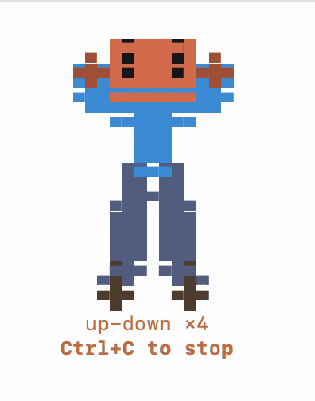

# claude-atone 🙇

[](https://github.com/aashutosh-prakash/claude-atone/actions/workflows/ci.yml)
[](https://www.npmjs.com/package/claude-atone)
[](LICENSE)

> When [Claude Code](https://claude.com/claude-code) admits a mistake, a little
> guy holds his ears and does up-down squats as punishment in a popup
> terminal.

<sub>Unofficial, community-maintained — not affiliated with Anthropic.</sub>

<p align="center">
  
</p>

**macOS only.** Pure Node + ANSI — no dependencies, no GIF, no Homebrew. The
animation is real pixel graphics painted as colored Unicode half-blocks (the
`chafa` technique, built in). When Claude's reply matches a "mistake" phrase, a
native dialog asks *"Do you want me to atone? 🙏"* — and only on **Yes** does the
animation play.

---

## Install

```bash
npx claude-atone
npx claude-atone --test      # pop the "atone?" dialog right now to verify it
```

That's it. The installer:

1. Adds a `Stop` hook to `~/.claude/settings.json` (appending — any existing
   hooks, e.g. `claude-nudge`, are **preserved**).
2. Copies the runner (`on-stop.mjs`) + animation (`updown.mjs`) to
   `~/.claude/claude-atone/` (a stable path that survives `npm` cache cleanup).
3. Snapshots your prior `settings.json` to `~/.claude/.claude-atone-backups/`
   (mode `0600`, 5 most recent kept), then writes **atomically** (temp file +
   `rename`) so an interrupted write can never corrupt your config.

It takes effect on your next interaction with Claude Code.

## Update

`npx` caches packages, so a bare `npx claude-atone` may run a stale version. Pin
`@latest` to force a fresh fetch and re-copy the runner:

```bash
npx claude-atone@latest
```

Then `npx claude-atone --doctor` confirms it — it reports the installed runner's
version and warns if it's stale relative to the package.

## Uninstall

```bash
npx claude-atone --uninstall
```

Removes the `Stop` hook and the runner directory. Settings backups are kept.

## Commands

| Command | Purpose |
|---|---|
| `npx claude-atone` | Install the `Stop` hook + runner |
| `npx claude-atone --test` | Pop the "atone?" dialog now (bypasses the cooldown) |
| `npx claude-atone --doctor` | Diagnose install health (platform, settings.json, runner, version, osascript) |
| `npx claude-atone --dry-run` | Show proposed changes without writing anything |
| `npx claude-atone --uninstall` | Remove the hook and the runner directory |
| `npx claude-atone --help` | Show help |
| `npx claude-atone --version` | Print version |

## How it works

```
Claude finishes a reply
   └─► Stop hook runs  on-stop.mjs
          └─► reads Claude's last_assistant_message from the payload
                └─► if it matches a "mistake" phrase
                     (you're right / my mistake / I apologize / sorry /
                      I was wrong / good catch / my bad / oops …)
                       └─► native dialog: "Do you want me to atone? 🙏"  [No] [Yes]
                              ├─ Yes → open a small Terminal window, play
                              │        updown.mjs --once (~5s), then auto-close
                              └─ No / ignore (30s timeout) → nothing
```

**Why a popup window?** Claude Code owns its own terminal screen (it's a TUI),
so an animation can't be painted into it without clashing. A separate window is
its own TTY, so it plays cleanly.

A 20-second cooldown keeps a burst of apologetic replies from stacking dialogs.

**Opens as a tab instead of a window?** That's the macOS *"Prefer tabs when
opening documents"* setting (**System Settings → Desktop & Dock**) — Terminal
gives AppleScript no way to override it. Set it to **"Manually"** for a clean
popup window. (Either way it still plays and closes itself afterward.)

## macOS permission

Opening that popup uses **Apple Events to control Terminal**, which macOS gates
behind the **Automation** permission. The first time the hook fires, macOS asks
*"…wants to control Terminal"* — click **OK**.

Run it up front so the first real one isn't missed:

```bash
npx claude-atone --test
```

If you dismissed the prompt and the animation never appears, re-enable it in
**System Settings → Privacy & Security → Automation**. (If permission is denied
the hook just does nothing — it never blocks or errors Claude Code.)

## What it writes to `settings.json`

```diff
  {
    "theme": "...",
    "permissions": { ... },
+   "hooks": {
+     "Stop": [
+       {
+         "hooks": [
+           {
+             "type": "command",
+             "command": "node /Users/<you>/.claude/claude-atone/on-stop.mjs"
+           }
+         ]
+       }
+     ]
+   }
  }
```

If you already have other `Stop` hooks, **they are preserved** — claude-atone
appends its own entry alongside them and removes only its own on uninstall.

## Try the animation directly

```bash
node ~/.claude/claude-atone/updown.mjs           # loops until Ctrl+C
node ~/.claude/claude-atone/updown.mjs --once     # ~5s, then exits
```

## Tuning

| What | Where |
| ---- | ----- |
| Trigger phrases | `TRIGGERS` array in `bin/on-stop.mjs` |
| Cooldown window | `COOLDOWN_MS` in `bin/on-stop.mjs` (default 20s) |
| Figure size | `W` / `H` at the top of `bin/updown.mjs` |
| Squat depth | the `hipY` formula in `drawFigure` |
| Speed | `setInterval(frame, 90)` (frame period, ms) + the `t * 0.5` ease factor |
| Run length (`--once`) | `ONCE_TICKS` in `bin/updown.mjs` (frames at 90ms; 55 ≈ 5s) |

Debug toggles (env vars): `CLAUDE_ATONE_DRYRUN=1` prints what would play instead
of opening a window; `CLAUDE_ATONE_DEBUG=1` logs to `~/.claude/claude-atone/run.log`.

## Security & privacy

- All processing is **local. Zero network calls. Zero telemetry. Zero runtime
  dependencies. Zero npm lifecycle scripts.**
- The hook reads Claude's last message (and, as a fallback, the tail of your
  transcript) **only** for case-insensitive substring matching — it is **never
  transmitted anywhere**, and never reaches an executed command.
- `osascript` is invoked with `argv` (no shell), so there's no AppleScript/shell
  injection from LLM text.
- The animation runs **only** after you click "Yes".
- `settings.json` is snapshotted and written atomically.

Full threat model and load-bearing invariants: [SECURITY.md](./SECURITY.md).

## Verifying the publish

```bash
npm audit signatures claude-atone
```

This package is published with [npm provenance](https://docs.npmjs.com/generating-provenance-statements)
— attestations linking the tarball back to the GitHub build that produced it.

## Requirements

- macOS (Darwin) — uses `osascript` to open the popup window
- Node.js ≥ 18
- A truecolor terminal (iTerm2, Terminal.app, VS Code terminal)
- Claude Code CLI installed

## Roadmap

- [ ] `--enable` / `--disable` toggle without full uninstall
- [ ] Configurable trigger phrases via the `env` block
- [ ] Linux/Windows window-spawning

## Contributing

See [CONTRIBUTING.md](./CONTRIBUTING.md). Issues and PRs welcome at
[aashutosh-prakash/claude-atone](https://github.com/aashutosh-prakash/claude-atone).

## Security

See [SECURITY.md](./SECURITY.md) for disclosure policy and security properties.
Report vulnerabilities privately to `aashutosh.code@gmail.com`.

## License

MIT — see [LICENSE](./LICENSE).

---

*Unofficial, community-maintained. Not affiliated with Anthropic.*
